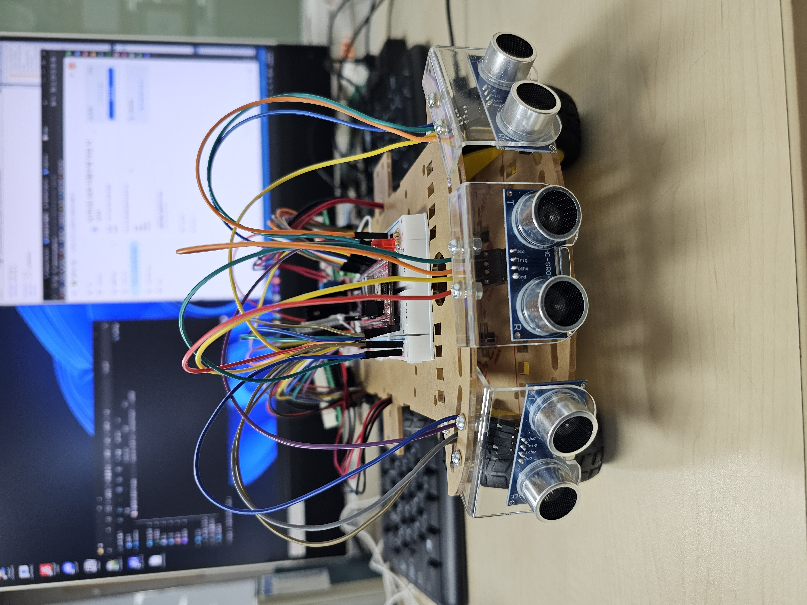
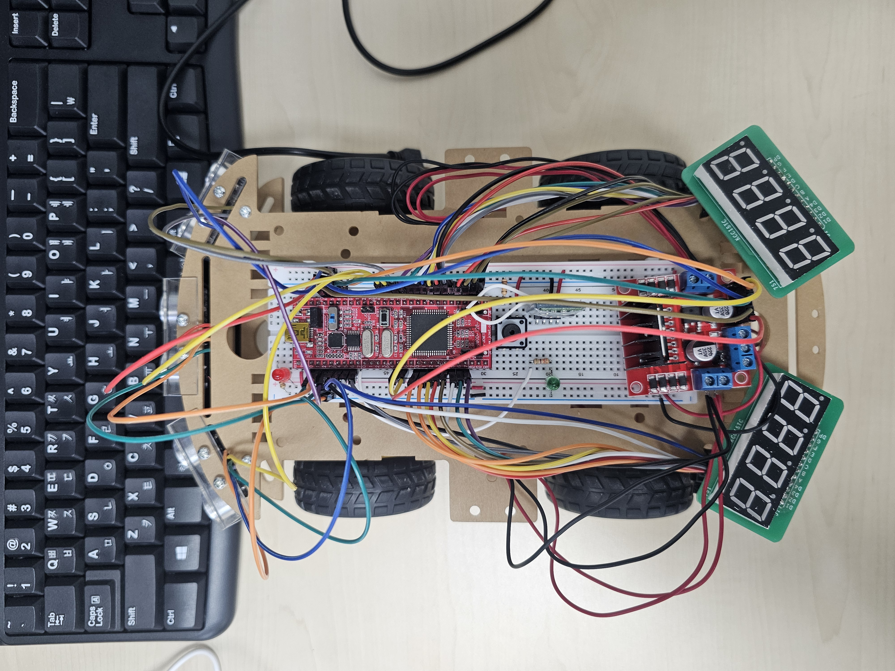
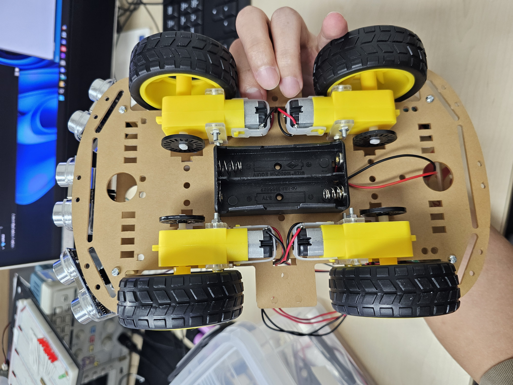
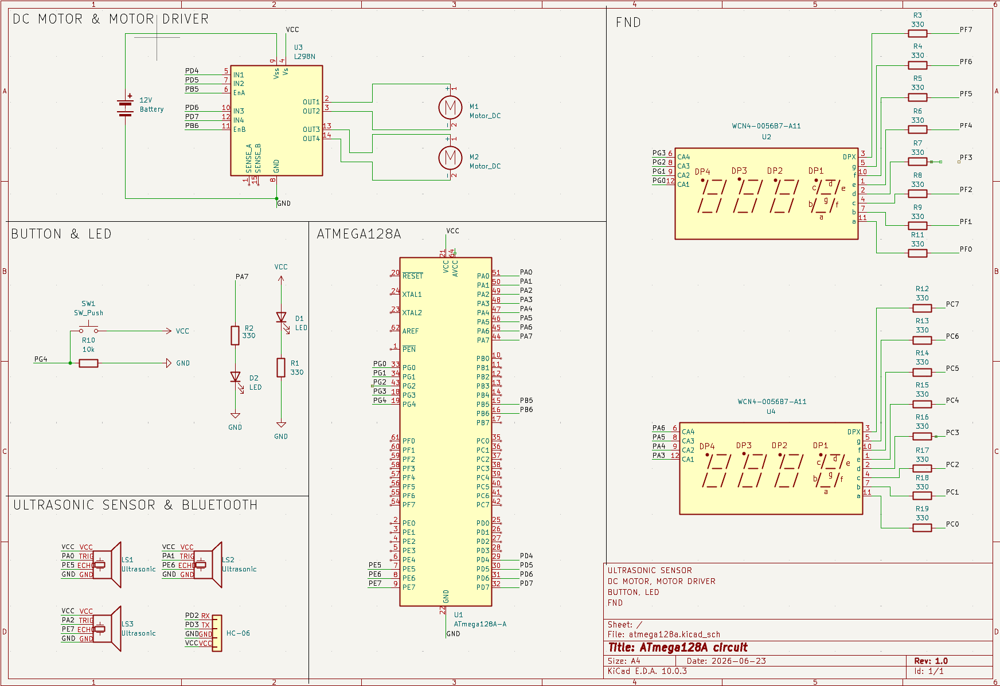
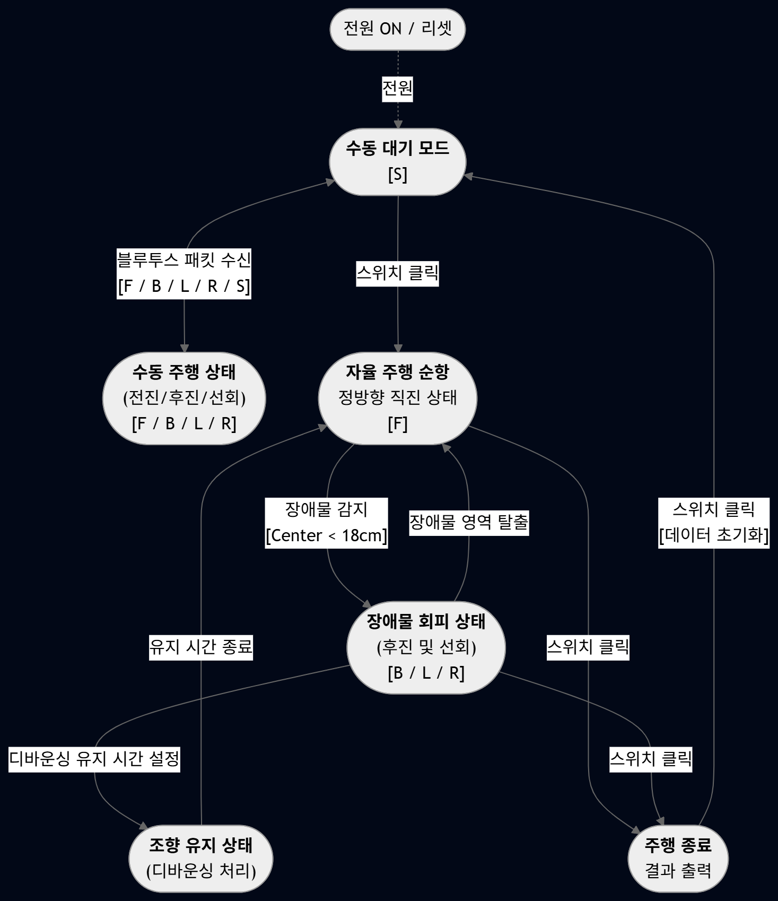

# 🚗 AVR 기반 초음파센서 자율주행차 프로젝트
> **Embedded System & Intelligent Control Project**

본 프로젝트는 **ATmega128 마이크로컨트롤러**를 기반으로 자율주행 알고리즘을 구현하고, 다양한 주변 장치를 통합 제어하는 시스템을 구축한 오픈소스 포트폴리오입니다.

---

## 👥 소개
* **개발 및 발표자:** 김호철

---

## 1. 프로젝트 개요

### 🎯 수행 목적
* **하드웨어 제어 능력 습득:** AVR ATmega128 마이크로컨트롤러의 주변 장치 제어 기법을 심층적으로 이해하고 자율 주행 알고리즘을 실무적으로 구현합니다.
* **통합 시스템 역량 강화:** 센서 데이터 처리, 모터 구동 제어, 무선 통신 인터페이스 등의 레이어를 결합하여 임베디드 아키텍처 구축 역량을 강화합니다.

### 🛠️ 핵심 구성 요소
* **ATmega128 MCU:** 타이머/카운터 및 인터럽트를 통한 시스템 총괄 제어
* **L298N 모터 드라이브 & PWM 제어:** 4개의 DC 모터 출력을 제어하고 회전 속도 및 방향을 정밀 제어
* **초음파 센서 (3개):** 차량 전방 및 좌우의 장애물 거리를 실시간 계측
* **Bluetooth 통신:** UART 직렬 통신을 이용한 무선 수동 조작 인터페이스 구축
* **7-Segment FND:** 주행 상태 가변 애니메이션 및 누적 기록 시각화

---

## 2. 하드웨어 조립 결과물 외관
> 차체 정면, 상단 회로부, 하단 배터리 및 모터 배치의 실제 모습입니다.

| 📷 정면 외관 (초음파 센서부) | 📷 상단 외관 (회로 및 MCU) | 📷 하단 외관 (배터리/모터) |
| :---: | :---: | :---: |
|  |  |  |
| *3방향 초음파 센서 배치* | *ATmega128 및 결선부* | *기어드 모터 및 구동부* |

*(※ 이미지 파일은 레포지토리 내 `images` 폴더를 생성하여 넣거나, 동영상처럼 에디터에 드래그 앤 드롭 하시면 됩니다.)*

---

## 3. 시스템 회로도
> KiCad를 활용하여 설계한 ATmega128A 메인 시스템 결선도입니다.

* **DC MOTOR & MOTOR DRIVER:** 포트 D의 GPIO 및 타이머 1번 PWM 제어 결선
* **ULTRASONIC SENSOR & BLUETOOTH:** 트리거 포트 A, 에코 인터럽트 포트 E 매핑
* **FND DISPLAY:** JTAG 간섭 해제 후 PORTC 및 PORTF 버스 라인 배선

---

## 4. 유한 상태 머신 (FSM)
> 시스템 초기화부터 주행 제어, 결과 대시보드 표출까지의 전체 상태 천이 모델입니다.

### 🔄 상태별 정의 및 천이 조건
* **수동 대기 모드 [S]:** 시스템 전원 인입 및 리셋 후 최초 진입하는 시스템 초기화 기점.
* **수동 주행 상태 [F/B/L/R]:** 블루투스로 수신된 패킷 명령에 따라 실시간으로 차량을 조종하는 상태.
* **자율 주행 순항 [F]:** 3방향 초음파 센서로 전방을 탐색하며 장애물이 없을 때 정방향 직진하는 주행 상태.
* **장애물 회피 상태 [B/L/R]:** 전방 또는 측방 장애물 감지 시 충돌 방지를 위해 역방향 후진 및 회피 선회를 구동하는 상태.
* **조향 유지 상태:** 소프트웨어 디바운싱 필터를 거쳐 일정 시간 동안 특정 조향 상태를 유지하는 과도기 상태.
* **주행 종료 및 결과 출력:** 스위치 입력 시 모터를 즉시 정지시키고 듀얼 FND 창에 누적 기록 데이터를 결산 표출하는 상태.

---

## 5. 실전 동작 구현 결과

### 🎬 5.1 Manual Mode (수동 조종 모드)
* **제어 시퀀스:** 스마트폰 앱 제어 신호 ➔ Bluetooth 모듈(RX) ➔ AVR MCU(UART 수신 인터럽트 파싱).
* **동작 매커니즘:** 파싱된 제어 명령어에 따라 모터 드라이버 인가 전압 플래그 가변 및 모터 PWM 작동.
* **구현 기능:** 전진(F), 후진(B), 좌회전(L), 우회전(R), 브레이크 정지(S) 명령 조향 제어 및 실시간 FND 연동 출력.

[[🎬 수동 조종 구동 비디오 첨부 공간]](https://github.com/user-attachments/assets/9c379bf1-484f-4004-98df-c9c92f59b938)

---

### 🎬 5.2 Auto Mode (자율 주행 모드)
* **전방 극접근 (<11cm):** 충돌 방지를 위해 즉시 역방향 **후진** 기동으로 장애물 탈출 경로 확보.
* **장애물 감지 (<18cm):** 좌측 및 우측 거리를 정밀 비교 연산하여 마진이 더 **넓은 공간 방향으로 회전 선회**.
* **측방 근접 (<11cm):** 좌/우 벽면 충돌을 사전 차단하기 위해 **반대 방향으로 조향 보정** 제어.
* **안전 확보:** 3방향의 장애물 위협 요소가 소거되면 정방향 전진 크루즈 순항 주행 유지.
* **추가 최적화:** 조향 직후의 관성 제어를 유도하는 **디바운싱 유지 시간(Hold Time) 설계** 및 센서 간 간섭을 상쇄하는 **20ms 시분할 순차 스캔 딜레이** 적용.

[🎬 자율 주행 회피 구동 비디오 첨부 공간]

---

### 🎬 5.3 FND Display 동작 (실시간 대시보드 UI)
* **실시간 조향 인디케이터:** 주행 상태에 맞춰 전진(`FFFF`), 후진(`bbbb`), 좌회전(`LLLL`), 우회전(`rrrr`), 정지(`StOP`) 전용 제어 프레임과 가변 무빙 애니메이션 동기화 표출.
* **최종 주행 통계 결산:** 주행 종료 후 버튼 조작을 통해 **[총 주행 시간 + 후진 횟수]**, **[좌회전 횟수 + 우회전 횟수]** 로그 기록을 상하위 자릿수 패킹 결합 수식(`FND_VAL = (DataA % 100) * 100 + (DataB % 100)`)으로 듀얼 FND 창에 동시 요약 출력.

[🎬 FND 상태 가변 및 대시보드 결산 비디오 첨부 공간]

---

## 6. 핵심 시행착오 및 결론

본 자율주행차 시스템을 구축하고 필드 트랙에서 주행 검증을 수행하기까지 발생한 물리적 한계점들을 다음과 같은 소프트웨어 알고리즘 기법을 통해 최적화 및 해결해 냈습니다.

* **스위치 입력 노이즈(Chattering) 해소:** 스위치 제어 트리거 진입 시 인입되는 전압 노이즈를 **소프트웨어 딜레이 디바운싱(Debouncing) 처리**를 설계하여 상태 천이 타이밍 오류의 원천적 차단 성공.
* **초음파 하드웨어 신호 간섭 차단:** 3개의 센서가 상시 구동될 때 발생하는 전파 회절 간섭 현상을 해결하기 위해, 센서별 트리거 발송 타임 갭에 **20ms 정밀 시분할 스캔 오프셋 딜레이를 계층 배치**하여 계측 거리 데이터 무결성 보장.
* **필드 임계값 커스터마이징:** 실제 트랙 환경에 부합하는 정밀 회피 기동을 구현하기 위해, 장애물 인지 임계 거리 파라미터 및 회전 각도에 매핑되는 좌우 모터 PWM 속도 비율 데이터 등을 **반복적인 테스트 주행을 거쳐 완벽히 튜닝 정착**.

> **Conclusion:** 본 프로젝트 과정을 거치며 임베디드 코어가 직면하는 다양한 물리적 리소스 제약과 하드웨어 노이즈 불안정성을, 견고하게 설계된 하드웨어 인터럽트 아키텍처와 소프트웨어 필터 알고리즘을 통해 완벽히 제어하고 실무적인 임베디드 제어 역량을 확고히 배양할 수 있었습니다.
